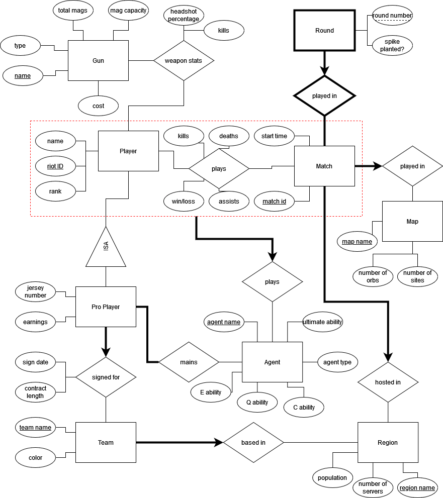

## This is a student project for an undergraduate database class

# Project Summary

This project focuses on modeling the various entities and relationships in Valorant such as players, matches, agents, maps, teams and region. The application could be used to track and manage data related to professional players like the matches they participate in and the statistics surrounding their performances.

# ER diagram

